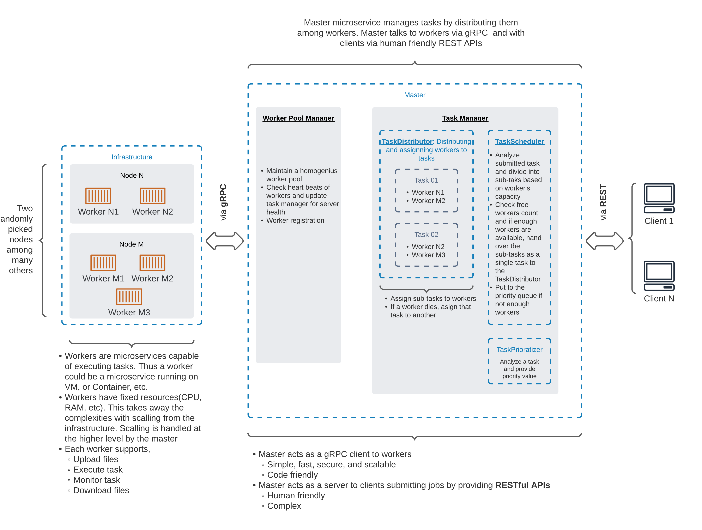

### ORION - A modern, distributed computing framework.

#### Authors
- [Tharindu Bandara](https://github.com/tharindu-bandara)

### Architecture

### Internal data flow diagram

## Testing
A single script for testbed deployment, and a comprehensive postman collection to showcase
the capabilities are included. Please refer the readme file in `<project-home>/integration` 
folder.
